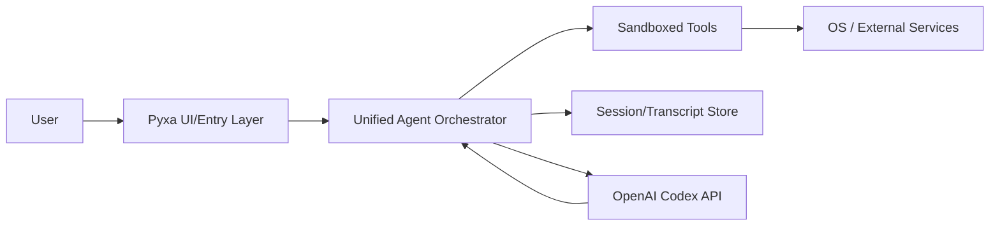
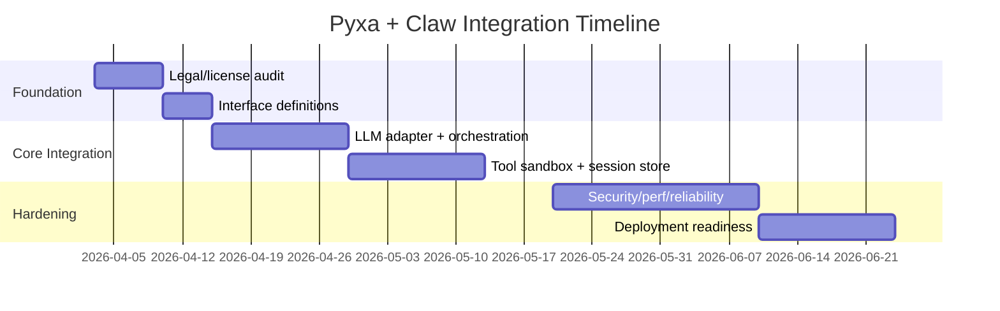

# Integration of Pyxa v1 with `instructkr/claw-code` using OpenAI Codex

## Executive summary

This document outlines a practical, risk-aware path to integrate a presumed Python-based Pyxa v1 codebase with `github.com/instructkr/claw-code`, while using OpenAI Codex models as the primary LLM backend.

**Bottom line:**

- **Technical fit:** likely strong (Python + agent-loop patterns).
- **Primary blocker:** legal and licensing uncertainty around `claw-code`.
- **Recommended approach:** treat `claw-code` as architectural reference, and re-implement required components clean-room style before production use.

---

## 1) Repository metadata checklist

Before coding integration, confirm these facts in your own environment:

- Pyxa v1 repository URL, default branch, and owners.
- Pyxa v1 license and contributor agreement status.
- `claw-code` current license status (or explicit permission from maintainers).
- Release/tag stability for both repos.

If either side has unclear rights, halt merge/copy work and move to architecture-only study mode.

---

## 2) Compatibility assessment

Assuming Pyxa v1 is Python-based:

- Align Python runtime (recommend 3.10+ minimum).
- Standardize dependency management (`pyproject.toml` or `requirements.txt`).
- Define a shared agent contract:
  - input message format
  - tool invocation format
  - streamed vs non-streamed model output
  - persisted session state schema

### Suggested merged architecture



---

## 3) Codex adapter design

Create a dedicated provider adapter (e.g., `llm/openai_adapter.py`) so model plumbing is isolated from agent logic.

```python
import os
from openai import OpenAI

client = OpenAI(api_key=os.environ["OPENAI_API_KEY"])

def codex_call(messages):
    response = client.responses.create(
        model="gpt-5.3-codex",
        input=messages,
        temperature=0.2,
    )
    return response.output_text
```

Implementation notes:

- Keep provider-specific logic out of orchestration core.
- Add retries with exponential backoff for rate limits.
- Add token/cost accounting per request.
- Do not log secrets or full sensitive prompts.

---

## 4) Security baseline

- **Secrets:** use environment variables or vault-backed injection; never commit keys.
- **Sandboxing:** enforce allowlists for shell/file/network tools.
- **Execution controls:** add timeouts, memory limits, and output truncation.
- **Prompt hygiene:** redact sensitive internal data before model calls.
- **Auditability:** log tool calls with redaction + request IDs.

---

## 5) Legal/licensing risk controls

Given uncertain provenance/license conditions around `claw-code`:

1. Avoid direct code copying until license rights are explicit.
2. Re-implement needed behavior from high-level specs/tests.
3. Keep a provenance log for every new module (author, source references).
4. Run legal review before external release or commercial deployment.

---

## 6) Delivery plan

### Week 1
- Validate licenses and legal constraints.
- Define architecture interfaces.
- Stand up OpenAI adapter + mocked tests.

### Month 1
- Build orchestrator integration.
- Port or re-create required tools with sandboxing.
- Implement session store and telemetry.

### Month 3
- Harden reliability (retries, circuit breakers, fallback models).
- Complete security review and load tests.
- Produce deployment runbook and rollback plan.



---

## 7) Go/No-Go gates

Proceed to production only if all are true:

- License/provenance risk accepted by legal.
- Secrets and tool sandbox controls pass security review.
- End-to-end tests and rollback procedure are validated.
- Cost/latency budgets are met under expected concurrency.

